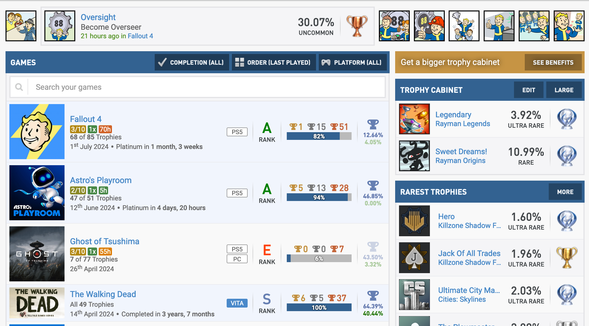
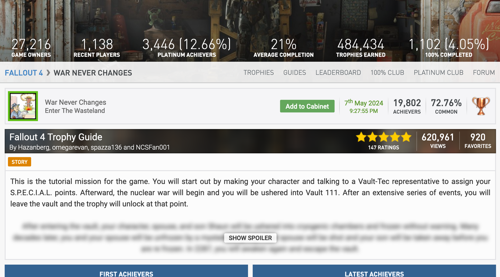
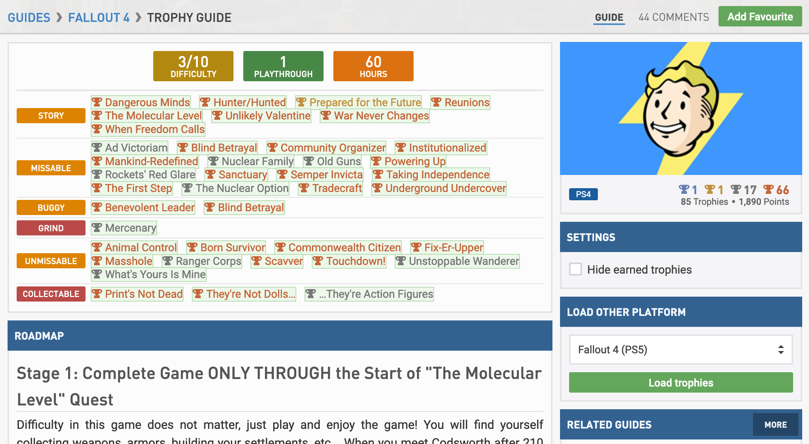

# PSNProfiles Extra

This is an open source project to add additional features to PSNProfiles.com by creating a plugin for various browsers. I'm working on this project for personal purposes and it's my goal to learn how to create a browser extensions and NOT to imitate and/or create a copy of existing extensions.

## Current features

- Game page
  - Display linked guide information
- Trophy page
  - Load and display missing guide description
- Guide page
  - All list and table items are checkable, and will be saved
  - Load trophies from a different platform (eg. guide is for PS4 and you're playing the PS5 version)

## Screenshots

## Build

### Create a build

1. Download and install [Node.js (LTS)](https://nodejs.org)
2. Restore NPM packages: `npm ci`
3. Build using `npm run build-{browser}` and replace `{browser}` with either `chrome`, `firefox` or `safari`. For hot-reload use: `npm run watch-{browser}`
4. In the folder `dist` will be the result, which can be loaded in the browser (see next section)

### Run a build

Follow the steps of the preferred browser to select the `manifest.json` and run the plugin

#### Chrome

1. Navigate to the Chrome extensions page (`chrome://extensions`).
2. Enable **Developer mode** in the top-right corner.
3. Verify that the **Load unpacked** option is available.
4. Select the `manifest.json` in the `chrome` folder of `dist` (regular build) or `build` (watch build)

#### Firefox

1. Navigate to the Addons debugging page (`about:debugging#/runtime/this-firefox`).
2. Search cog-icon and navigate to **Debug Add-ons**.
3. Verify that the **Temporary Extensions** section and the **Load Temporary Add-on...** option are available.
4. Select the `manifest.json` in the `chrome` folder of `dist` (regular build) or `build` (watch build)
